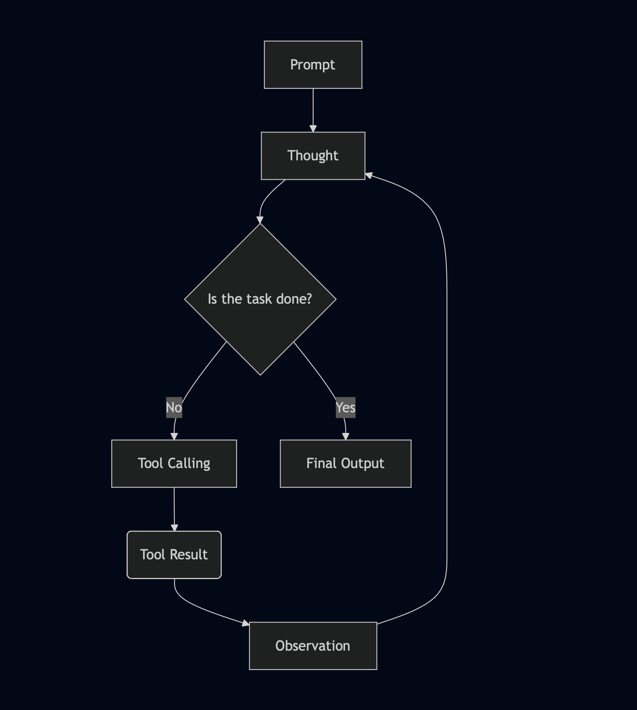

# LobsterX🦞

LobsterX is an AI agent inspired by [OpenClaw](https://openclaw.ai) (formerly known as MoltBot or ClawdBot), which focuses on document-related tasks.

It runs as a Telegram bot as comes with a CLI interface to set up the necessary environment variables.

## Prerequisites

- Python (if setting up the bot natively, preferably with `uv`) or Docker (if deploying with Docker)
- A Telegram Bot Token, in order to connect to Telegram. Follow [this guide](https://core.telegram.org/bots/tutorial) on how to create your Telegram bot with BotFather.
- A LlamaCloud API key, in order to give LobsterX document-processing capabilities. Sign up on LlamaCloud [here](https://cloud.llamaindex.ai/signup).
- An API key for Google, OpenAI or Anthropic (you can choose one among the three or swap between different providers)

## Installation

Install the bot natively:

```bash
# uv (recommended)
uv tool install lobsterx --prerelease=allow
# pip
pip install lobsterx
```

Pull the docker image (only works for AMD64-compatible platforms):

```bash
docker pull ghcr.io/astrabert/lobsterx:main
```

## Setup

Through environment variables, you can customize the setup of LobsterX:

- `LOBSTERX_LLM_PROVIDER`: LLM provider (choose between `google`, `anthropic` and `openai`). Default is `openai`
- `LOBSTERX_LLM_MODEL`: LLM model (choose among [available models](../../README.md#available-llm-models)). Default is `gpt-4.1`

You then need to set three required env variables:

- `LOBSTERX_LLM_API_KEY`: API key for the LLM (you can also use `OPENAI_API_KEY`, `GOOGLE_API_KEY` or `ANTHROPIC_API_KEY`, depending on the provider).
- `TELEGRAM_BOT_TOKEN`: token for the Telegram bot
- `LLAMA_CLOUD_API_KEY`: API key for LlamaCloud

If you wish to setup LobsterX as an API server, you will need to set an API key that only you can use to interact with it, set in the environment as `LOBSTERX_SERVER_KEY`. The key has to be at least 32 charachters long and contain only lowercase and uppercase alphanumeric characters, `-` and `_`.

You can use the setup wizard to configure LobsterX interactively on the terminal:

```bash
lobsterx setup --interactive
```

Or pass options from CLI:

```bash
lobsterx setup --provider google \
    --model gemini-3-flash-preview \
    --api-key $GOOGLE_API_KEY \
    --llama-cloud-key $LLAMA_CLOUD_API_KEY \
    --telegram-token $TELEGRAM_BOT_TOKEN \
    --server-key $SERVER_KEY
```

This will create a `.env` file with the necessary variables, which will be loaded by LobsterX at runtime (make sure not to share it with anyone).

If you wish to further customize the instructions that LobsterX has access to, you can use an **AGENTS.md** file, saved under the same directory where the agent process is running.

## Run

### As a Telegram Bot

Run LobsterX as a Telegram Bot:

```bash
lobsterx run 
```

You can set the `--log-level` option, if you wish to have more or less logging.

Run LobsterX in a Docker container referencing a `.env` file:

```bash
docker run ghcr.io/astrabert/lobsterx:main --env-file=".env"
```

Or, setting env varaibles directly (not recommended):

```bash
docker run ghcr.io/astrabert/lobsterx:main \
    --env="LOBSTERX_LLM_PROVIDER=openai" \
    --env="LOBSTERX_LLM_MODEL=gpt-4.1"\
    --env="LOBSTERX_LLM_API_KEY=sk-xxx" \
    --env="LLAMA_CLOUD_API_KEY=llx-xxx" \
    --env="TELEGRAM_BOT_TOKEN=tok-xxx"
```

When on Telegram, you can perform two actions:

- Sending PDF files, which will be downloaded by the bot
- Sending text messages, which will work as prompts for the bot to start a new task

> _With `/start` command, you will have a welcome message explaining how to use the bot_

### As an API server

To run as an API server, you need to specify a series of options that are necessary for authentication, rate limiting and CORS.

- For **authentication**, you need to set the `LOBSTERX_SERVER_KEY` within the environment or in a `.env` file in the same working directory as the agent
- For **CORS**, you can set a list of allowed origins
- For **rate limiting**, you can set the maximum limits of file uploads, task creations, task polling and task deletion per minute

In addition to these, you will also need to provide the host (`0.0.0.0` e.g.), port (`8000` e.g.) and protocol (`http` or `https`) on which the server will run.

You can provide all of these details directly from the CLI:

```bash
lobsterx serve \
    --file-downloads-per-minute 300 \
    --create-tasks-per-minute 60 \
    --delete-tasks-per-minute 60 \
    --poll-tasks-per-minute 300 \
    --bind 0.0.0.0 \
    --port 8000 \
    --protocol http \
    --allow https://example.com \
    --allow https://anotherexample.com
```

> All of these options have sensible defaults, but personalization is always recommended

Or create a JSON configuration ([as in thie example](config.api.json)) following this specification:

```json
{
  "allow_origins": [],
  "file_downloads_per_minute": 300,
  "create_tasks_per_minute": 60,
  "delete_tasks_per_minute": 60,
  "poll_tasks_per_minute": 300,
  "host": "0.0.0.0",
  "port": 8000,
  "protocol": "http"
}
```

And provide it to the CLI:

```bash
lobsterx serve --config config.api.json
```

> The configuration approach is recommended, as it can be re-use through different API-related commands.

Once you are serving your API through `lobsterx serve`, you can:

- Upload files, by sending a POST request to `/files`
- Create tasks, by sending a POST request to `/task`
- Get the status of a task, by sending a GET request to `/task/{task_id}`
- Cancel a task, by sending a DELETE request to `/task/{task_id}`

You don't have to do this through raw API calls, the LobsterX CLI provides several commands to perform these operations on your behalf:

```bash
# upload a file
lobsterx upload-file path/to/file.pdf --config config.api.json # pass the server configuration
# start a task
lobsterx create-task "Your prompt" --config config.api.json # this will return a task ID
# check the status of a task
lobsterx get-task some-task-id --config config.api.json
# cancel a task 
lobsterx cancel-task some-task-id --config config.api.json
# wait until a task is complete
lobsterx wait-task some-task-id --config config.api.json --polling-interval 2.0 --max-attempts 900 --verbose
```

## How LobsterX Works

LobsterX is a generalist AI agent based on three main principles:

- [LlamaIndex Agent Workflows](https://github.com/run-llama/workflows-py): a powerful workflow engine that allows event-driven, stepwise execution of specific tasks and functions. LobsterX uses a cyclic workflow to go through thinking, tool-calling and observing repeatedly until it produces its final output.
- Structured outputs: the LLM underlying the agent is forced to produce JSON outputs that comply with certain schemas (a tool call, a thought, an observation...): outputs are produced informed by the previous chat history, and based on context about available tools and specific tasks the agent has to perform.
- Security by design: the agent does not have access to your real filesystem, but it does have access to a virtualized copy of it provided through [AgentFS](https://github.com/tursodatabase/agentfs). PDFs sent over Telegram are also not downloaded into your real filesystem, but written within AgentFS. Files such as `.env`s or other popular credential files (`.npmrc`, `.pypirc`, `.netrc`) are excluded from the virtual filesystem, and thus unaccessible to the agent. The agent cannot use bash commands (it has access to filesystem-based tools like read/write/edit/grep/glob for AgentFS) to avoid it being able to perform destructive or vulnerable operations.

Here is what happens when you send a prompt to LobsterX:



Along with the final response, the agent will also send you a report of everything it did during its session as a markdown file (namedd `session-<random-id>-report.md`).

### The API server

While sharing the core desing principles outlined above, the API server has some more features related to the data flow:

- When a POST request to the `/tasks` endpoint (task creation) is made, a new `asyncio.Task` is spawned and stored within a in-memory task manager, using a locked dictionary to associate a task ID with an async Task.
- When a GET request is sent to `/task/{task_id}`, the task manager provides details on the status of the task (`success`, `failed`, `cancelled`, `pending`). If the task was succesfull, failed or was cancelled, it is removed from the dictionary.
- When a DELETE request is sent to `/task/{task_id}`, the async Task is cancelled and removed from the dictionary

Besides the Task Manager, the API server uses an in-memory rate limiter ([`fastapi-throttle`](https://github.com/AliYmn/fastapi-throttle)) and Starlette CORS and Auth middleawares to provide authentication (through a `Bearer` token provided with an `Authorization` header) and CORS servicres.

## License

This package is provided under [MIT License](./LICENSE)

## Contributing

For contributions, refer to the [contributing guide](../../CONTRIBUTING.md)
